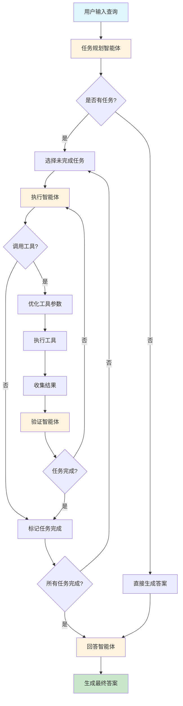

# Gems 🤖 价值投资分析智能体

Gems 是一个自主的价值投资研究智能体，能够思考、规划和学习。它通过任务规划、自我反思和实时市场数据进行深度分析。专为价值投资分析而构建的智能研究助手。

## 概述

Gems 能够将复杂的投资问题转化为清晰、分步骤的研究计划。它使用实时市场数据执行这些任务，检查自己的工作，并不断优化结果，直到得出有数据支撑的可靠答案。

这不仅仅是另一个聊天机器人。这是一个能够提前规划、验证进度并持续迭代直到任务完成的智能体。

**核心能力:**
- **智能任务规划**: 自动将复杂查询分解为结构化的研究步骤
- **自主执行**: 选择并执行合适的工具来收集财务数据
- **自我验证**: 检查工作成果并迭代直到任务完成
- **实时财务数据**: 访问利润表、资产负债表和现金流量表
- **安全特性**: 内置循环检测和步骤限制，防止无限执行

## 快速开始

### 环境要求

- Python 3.10 或更高版本
- [uv](https://github.com/astral-sh/uv) 包管理器
- DeepSeek API 密钥 或 DashScope API 密钥（用于Qwen3）

### 安装

#### 方法一：通过 npm 安装（推荐）

```bash
# 全局安装
npm install -g gems-agent

# 或者本地安装
npm install gems-agent
```

#### 方法二：从源码安装

1. 克隆仓库:
```bash
git clone https://github.com/xiaoCarl/gems.git
cd gems
```

2. 使用 uv 安装依赖:
```bash
uv sync
```

3. 设置环境变量:
```bash
# 复制环境变量示例文件
cp env.example .env

# 编辑 .env 文件并添加您的 API 密钥
# 对于 DeepSeek:
# DEEPSEEK_API_KEY=your-deepseek-api-key
# 
# 对于 Qwen:
# USE_QWEN=true
# DASHSCOPE_API_KEY=your-dashscope-api-key
```

### 使用方式

#### 通过 npm 安装后：
```bash
gems-agent
```

#### 从源码安装：
```bash
uv run gems-agent
```

**新架构特性**:
- 🚀 **零UI依赖**: 不再依赖 rich 或 prompt-toolkit，启动更快更稳定
- 📊 **简单输出**: 使用简洁的文本输出，专注于核心分析功能
- 🔧 **轻量级**: 依赖更少，维护更简单
- 📦 **npm 包支持**: 可通过 npm 安装，方便 Node.js 生态用户使用

### 示例查询

尝试向 Gems 提问，例如:
- "贵州茅台的市盈率和市净率是多少？"
- "分析宁德时代的财务健康状况"

Gems 将自动:
1. 将您的问题分解为研究任务
2. 获取必要的财务数据
3. 执行计算和分析
4. 提供全面、数据丰富的答案

## 支持的模型

Gems 支持多种大语言模型:

### DeepSeek (默认)
默认使用 DeepSeek 模型，需要设置 `DEEPSEEK_API_KEY` 环境变量。

### Qwen
要使用 Qwen-plus 模型，请设置以下环境变量:
```bash
USE_QWEN=true
DASHSCOPE_API_KEY=your-dashscope-api-key
```

## 架构设计

Gems 采用多智能体架构，包含专门化的组件:

- **规划智能体**: 分析查询并创建结构化的任务列表
- **执行智能体**: 选择合适的工具并执行研究步骤
- **验证智能体**: 验证任务完成情况和数据充分性
- **回答智能体**: 将发现综合为全面的回答

### 数据源架构

Gems 采用双数据源架构，充分利用各数据源的优势：

- **通达信API**: 主要实时数据源，提供高稳定性、低延迟的A股和港股实时行情
- **AkShare**: 主要财务数据源，提供全面的季报、年报等财务数据

**数据源分工**:
- 实时行情数据 → 通达信API（优先）
- 财务数据（季报、年报） → AkShare
- 备用实时数据 → AkShare（当通达信不可用时）

## 配置

Gems 支持通过 `Agent` 类初始化进行配置:

```python
from gems.agent import Agent

agent = Agent(
    max_steps=20,              # 全局安全限制
    max_steps_per_task=5       # 每个任务的迭代限制
)
```

## 如何贡献

1. Fork 本仓库
2. 创建功能分支
3. 提交您的更改
4. 推送到分支
5. 创建 Pull Request

**重要**: 请保持您的 pull request 小而专注，这将使审查和合并更容易。

## 许可证

本项目采用 MIT 许可证。

## 架构优势

### 重构后的改进

- 🚀 **性能提升**: 移除复杂UI依赖，启动速度更快
- 🔧 **维护简化**: 依赖更少，代码更简洁
- 📊 **专注核心**: 专注于财务分析功能，而非界面渲染
- 💪 **稳定性增强**: 简单输出系统更可靠，减少潜在错误

### 价值投资理念

Gems 基于经典价值投资理念构建，专注于:
- 基本面分析
- 财务比率计算
- 现金流分析
- 盈利能力评估
- 风险评估
- 估值分析

通过智能化的数据收集和分析，帮助投资者做出更明智的投资决策。


## 工作流程

Gems 采用智能化的多步骤工作流程来处理用户查询：



### 流程详解

1. **任务规划阶段**
   - 分析用户查询并分解为结构化的任务列表
   - 如果查询超出金融研究范围，直接进入答案生成

2. **任务执行循环**
   - 选择下一个未完成的任务
   - 执行智能体决定要调用的工具
   - 优化工具参数以提高结果质量
   - 执行工具并收集数据

3. **验证检查**
   - 验证智能体检查收集的数据是否足够完成任务
   - 如果数据不足，继续执行更多工具调用
   - 如果数据足够，标记任务完成

4. **答案生成**
   - 所有任务完成后，回答智能体综合所有数据
   - 生成全面、数据驱动的最终答案

### 安全机制

- **循环检测**: 防止重复执行相同操作
- **步骤限制**: 全局和每个任务的执行次数限制
- **工具确认**: 在执行潜在风险操作前进行确认
